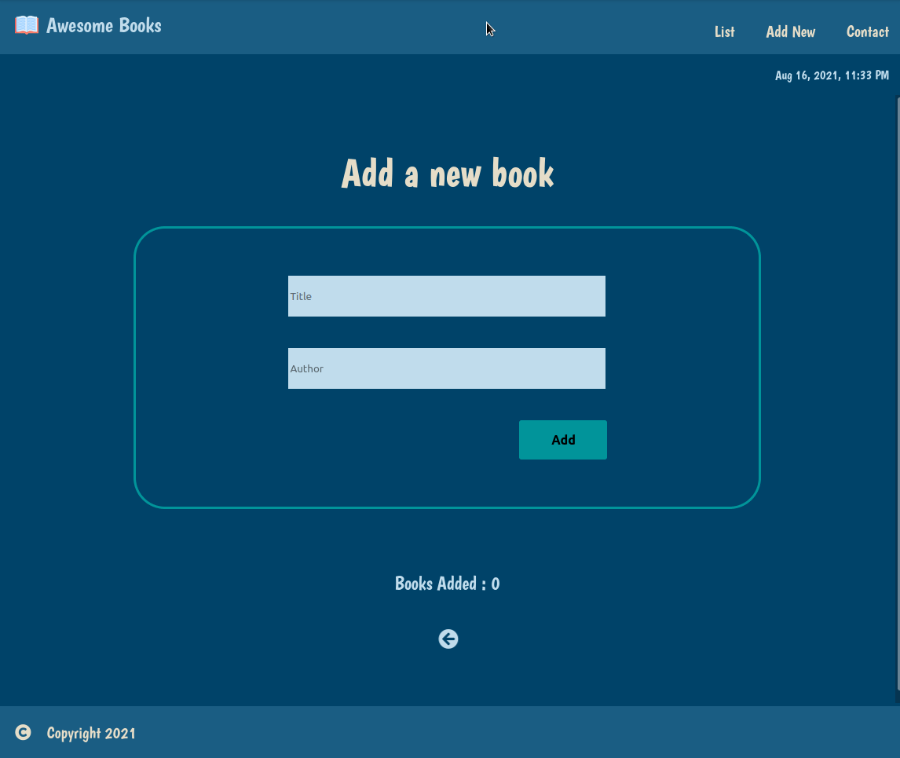

# Awesome Books

> this is a simple page that saves your list of ffavorite books in the browser.

## Live Demo

[live](https://benwmx.github.io/Awesome-books/)

## Screenshot

Additional description about the project and its features.

## Built With

- Html
- Css
- JavaScript

## Authors

👤 **Rachid Boudaoudi **

- GitHub: [@benwmx](https://github.com/benwmx)
- Twitter: [@ben-wmx](https://twitter.com/ben_wmx)
- LinkedIn: [Rachid Boudaoudi](https://www.linkedin.com/in/rachid-boudaoudi-1621a0183/)

## 🤝 Contributing

Contributions, issues, and feature requests are welcome!

Feel free to check the [issues page](../../issues/).

## Show your support

Give a ⭐️ if you like this project!

## 📝 License

This project is [MIT](./MIT.md) licensed.
